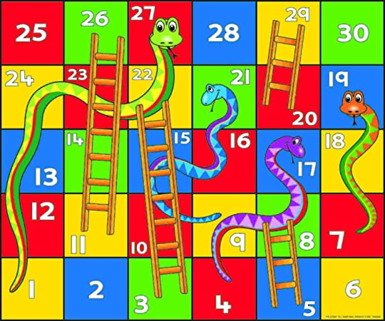

# Programozás alapjai 2. - ZH
2021.03.26.

## 0. Bevezető
A feladat egy *Snakes and Ladders* játék leprogramozása lesz.
A táblajátékot akárhány játékos játszhatja (de legalább 2-nél van értelme). 
Kezdetben minden játékos bábuja az `1`-es mezőn van, majd a szokásos módon körbemenve dobnak egy szabályos 6 oldalú dobókockával. 
Amennyit dobnak, annyival lépnek előre a táblán. 
Az nyer, aki elsőként lép az utolsó mezőre.

Egy példa játéktábla:



A bábuk mozgását illetően még 3 további szabály fontos:
- Ha egy kígyó fejére lépünk, lecsúszunk a farkáig.
- Ha egy létra aljához lépünk, felmászunk a tetejére.
- A pálya legvégén ha többet dobunk, mint amennyi az utolsó mező eléréséhez kellene, akkor a többletet visszafele lépjük le.
 
Tehát ha a fenti táblán például a `28`-as mezőn állva 5-öt dobunk, akkor a `27`-es mezőre lépünk, de az pont egy kígyó feje, így lecsúszunk az `1`-es mezőre.

Könnyen észrevehető, hogy a játékban igazából semmilyen döntést nem hoz meg egyik játékos sem, minden a kockadobásokon múlik, így könnyen szimulálható egy játék automatikusan.

## 1. `Board` osztály

Az első osztályunk egy pályát modellezen le.
Inicializáláshoz kapjon egy számot, ami a megadja a pálya méretét.

Például a fenti pálya elkészítésének elkezdéséhez:
```python
board = Board(30)
```

Legyen az osztálynak egy `_valid_field` függvénye, mely leteszteli, hogy egy mező létezik-e, azaz az 1 és az inicializálásnál megadott méret között van-e.

```python
board._valid_field(1)  # True
board._valid_field(30) # True
board._valid_field(0)  # False
board._valid_field(42) # False
```

Legyen az osztálnynak egy `_free_field` metódusa, ami akkor ad vissza `True`-t, ha a mező létezik, nem a célmező, és egyetlen kígyó feje/farka vagy létra alja/teteje sem található ott.
Megintcsak a fenti tábla példáival élve:

```python
board._free_field(0)    # False
board._free_field(2)    # True
board._free_field(30)   # False
board._free_field(42)   # False
```

Ezen a ponton egy `board_free_field(3)` még `True`-t adna vissza, hiszen még egyetlen létrát, kígyót sem adtunk hozzá a táblához. 

Ezt a hozzáadást az `add_jump` függvény valósítja meg. 
Vegyük észre, hogy az egyetlen különbség egy kígyó és egy létra között, hogy az egyiken visszafele, a másikon előrefele ugrunk, de ugyanúgy egy ugrást jelent mindkettő, így kezelhetjük őket egyformán.
A függvény két paramétert vár: hogy melyik mezőről hova visz az ugrás.
A fenti táblának megfelelően például így pakolhatjuk fel a kígyókat, létrákat a táblára:

```python
board.add_jump(27,1)  # Green snek
board.add_jump(21,9)  # Blue snek
board.add_jump(19,7)  # Purple snek
board.add_jump(17,4)  # Green-orange snek
board.add_jump(3,22)  # One of the big ladders
board.add_jump(5,8)   # One of the small ladders
board.add_jump(11,26) # The other big ladder
board.add_jump(20,29) # The other small ladder
```

A függvény hajtson végre ellenőrzéseket. 
Csak akkor engedjen egy ugrást hozzáadni, ha a kiinduló és a landoló mező is szabad (`_free_field`), és nem helyben ugrálna. 
Ha ezek teljesülnek, vegye fel az ugrást, és adjon vissza `True`-t, egyébként ne adja hozzá, és adjon vissza `False`-ot.

A fenti hozzáadások mind kell, hogy sikerüljenek, de utánuk ezek egyike sem szabad:
```python
board.add_jump(27,1)  # Green snek again
board.add_jump(23,1)  # Tail overlaps with green snek
board.add_jump(6,30)  # Final field is not free
board.add_jump(0,10)  # Not a valid source field
```

Az utolsó metódusa a `Board` osztálynak egy `move`, mely egy bábu mozgatását oldja meg.
Vár egy mezőt (feltételezheti, hogy értelmes mező) ahol a bábyu most áll, dob egyet a 6 oldalú dobókockával (random), lép (a végén visszafele, ha kell), ugrik (ha kell), majd visszaadja, hogy ezután hol landolna a bábu.

Mivel véletlenszerűen dob, tesztelő kimenet-benet párokat nem lehet adni, de a fenti példát alkalmazva, a `board.move(28)` __ha__ belül ötöt dobna, akkor `1`-gyel térne vissza.


# 2. `Game` osztály

Ez az osztály lesz felelős játékok levezényléséért.
Inicializáláskor két argumentumot vár: egy táblát, amin majd játékokat szimulál, valamint egy felső korlátot a körök számára, amit ha elér, akkor "lelövi" majd a játékot.

```python
impossible_game=Game(board,1)
game=Game(board,40)
```

Az első játék nyilván sossem fog normálisan befejeződni, mert 1 lépésből egyik játékos sem tud eljutni a 30-as mezőre a bevitt táblán. 
A másodiknál már azért elég jó esély van rá.

Ezen kívül egyetlen másik függvénye van az osztálynak: `simulate_game`, mely leszimulál egy játékot a paraméterben megadott játékosok listájával, és visszatér a győztes játékos nevével.
Ha a megadott körök száma alatt nem sikerül senkinek sem nyernie, akkor dob egy `Exception`-t valamilyen erre utaló szöveggel.

```python
impossible_game.simulate_game(['Annie' , 'Betholdt', 'Reiner', 'Marcel'])
game.simulate_game(['Annie' , 'Betholdt', 'Reiner', 'Marcel'])
```

Az első garantáltan kivételt dob, a második várhatóan visszaadja valamelyik játékos nevét.
Az én tesztfuttatásomnál Reiner nyert.


# 3. Statisztika a táblán

A táblajátékokon hiába véletlenek a dobások, [nem minden mező egyenlő](https://www.youtube.com/watch?v=ubQXz5RBBtU).
Mi most a játékunknál azt szeretnénk megnézni, hogy melyik ugrás hányszor volt használva egy vagy több játék során. 

Ezért a következő módosításokat hajtsuk végre a `Board` osztályon. (Aki szebben szeretné megcsinálni, egy származtatott osztályon.)

Legyen az osztálynak egy `reset_statistics` függvénye, mely nem vár paramétert, egyszerűen csak nullázza minden létrához a számlálónkat. 

A `move` függvény módosuljon úgy, hogy amikor ugrunk, akkor azt jegyezze fel.

Végezetül legyen egy `draw_statistics` függvénye, mely argumentumként vár egy fájlnevet, és készít egy egyszerű diagrammot, amin látszódik, hogy melyik ugrás hányszor volt használva. 
A diagramm stílusa, színek, formázás, stb. szabadon testreszabható.

Ezeket a függvényeket tesztelő, egy játékot lejátszó kódrészlet pl:
```python
game=Game(board,40)
board.reset_statistics()
try:
    winner = game.simulate_game(['Annie' , 'Betholdt', 'Reiner', 'Marcel'])
    print("The winner is {}".format(winner))
except Exception as e:
    print(e)
board.draw_statistics("1_game.png")
```
Aminek nálam `Reiner` lett a kimenete, és így néz ki az [1_game.png`](1_game.png)


A következő kódrészlet 9999 játékot futtat le ugyanazzal a 4 játékossal:
```python
board.reset_statistics()
for _ in range(9999):
    try:
        winner = game.simulate_game(['Annie' , 'Betholdt', 'Reiner', 'Marcel'])
    except:
        pass
board.draw_statistics("9999_games.png")
```
A [9999_games.png`](9999_games.png) pedig így néz ki:


Ez alapján jól látható, hogy se a kígyók, sem a létrák nem egyenlők, vannak amelyikekre sokkal nagyobb eséllyel lép rá valaki, mint másikakra.

# 4. Tesztelés

A [`main.py`](main.py)-ban egyben megtalálhatók a fenti kódrészletek. 
A tesztelhető függvények itt megadott tesztjeit tessék doctest-be beletenni. 